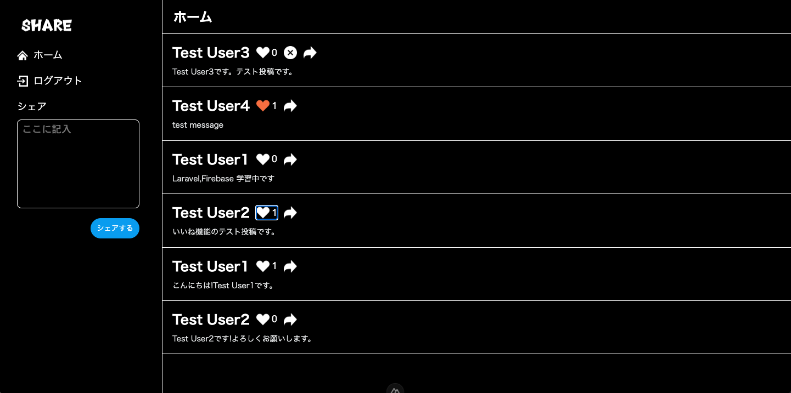
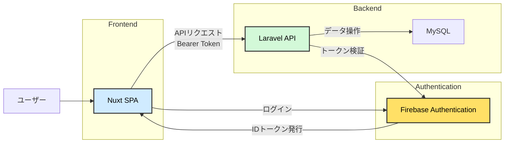

# Twitter風SNSアプリ - (Frontend)

## 概要

Twitter風の簡易SNSアプリのフロントエンドです。
Nuxt 4 を使用してUIを構築し、LaravelのBackend APIと連携しています。

## トップ画面

## 作成した目的

- LaravelとNuxtのAPI連携によるモダンなWebアプリ構成の理解
- Firebase Authenticationを用いたトークン認証の実装経験
- フロントエンド／バックエンド分離構成での開発演習

## 関連リポジトリ

- Frontend: https://github.com/okumurachie/Twitter-frontend
- Backend: https://github.com/okumurachie/Twitter-backend

## アプリケーションURL

※ 本アプリはローカル環境での動作を前提としています。デプロイは行っていません。

## 使用技術

- Nuxt 4(Vue 3)
- Pinia(状態管理)
- Firebase 12系(認証)
- vee-validate + yup(フォームバリデーション)
- REST API（Laravel連携）

## 主な機能

- Firebase Authentication（フロント側ログイン管理）
- 投稿の一覧表示
- 投稿作成・削除(認証ユーザーのみ)
- いいね機能(重複防止)
- コメント機能
- 投稿作成・削除・コメント追加・いいね機能は認証ユーザーのみ操作可能
- 非同期通信(API連携)
- 状態管理(ログイン状態保持)
- 自身の投稿のみ削除可能

## UI設計

- Twitter/X ライクな SNS UI を Nuxt 4 で実装
- PC / スマートフォン両対応（レスポンシブ）
- スマートフォン表示では、ナビゲーション簡略化
- コンポーネント設計を意識し、責務分離を実施

## 工夫した点

1. スマートフォン表示ではサイドバーを非表示、ハンバーガーメニュークリックでサイドメニューを開閉
    - SNSアプリはスマートフォンから利用されることが多いと考え、スマートフォンでの操作性を意識してUIを調整しました。
2. Vueコンポーネントの分割
    - 再利用性は保守性を考え、投稿フォームを独立したコンポーネントに切り出すなど、コンポーネントの役割を分けました。コードの可読性と、将来的に機能追加や修正がしすい構成を意識しました。投稿機能は複数の画面で使われる可能性もあるので、投稿フォームを独立したコンポーネントにしておくことで、
      別画面でも再利用できるようにしました。
    - フロントエンドでは、UIの見た目だけではなく、再利用性や保守性を高めることも意識しました。

## アーキテクチャ

本アプリは、フロントエンドとバックエンドを分離したSPA構成で開発しています。

### 構成概要

- フロントエンド： Nuxt(SPA)
  -- UI表示、ユーザー操作を担当
- バックエンド： Laravel(APIサーバー)
  -- データ処理、ビジネスロジックを担当
- 認証： Firebase Authentication
  -- ユーザー認証およびIDトークン発行

## アーキテクチャ図

### 処理の流れ

1. ユーザーがNuxtアプリからログイン
2. Firebase Authenticationで認証を行い、IDトークンを取得
3. フロントエンドからLaravel APIへリクエスト送信(Bearerトークン付き)
4. Laravel側でトークンを検証し、認証済みユーザーのみ処理を許可
5. 問題がなければMySQLに対してデータの取得・保存を実行

### データフロー

- 「フロントはNuxtのSPAで構築し、認証はFirebase Authenticationを利用しています。
  ログイン後に取得したIDトークンをBearerトークンとしてLaravel APIに送信し、
  Laravel側ではミドルウェアでFirebaseのトークン検証を行っています。
  バックエンドでは認証済みユーザーのみDB操作を許可する構成にしています。」

### 設計意図

- フロントとバックエンドを分離することで、それぞれの責務を明確化
- Firebase Authenticationを利用することで、安全なトークン認証を実現
- SPA構成より、快適なユーザー体験を提供

## 技術選定理由

- Firebase Authenticationを採用した理由
- セキュアな認証機能を短期間で実装できるため
- トークンベース認証をSPA構成と相性良く扱えるため

## 今後の課題

本アプリは基本的なSNS機能の実装に留まっているため、今後はより実践的な機能や設計の改善に取り組みたいと考えています。

### 機能拡張

- 画像投稿機能の追加
    - Firebase StorageやS3などを利用し、画像アップロード機能を実装
    - 投稿データと画像の関連付けを行い、SNSとしての表現力を向上させる

- フォロー機能の実装
    - ユーザー同士の関係性を構築し、タイムラインのパーソナライズを実現
    - フォロー・フォロワー一覧の表示機能も追加

- 通知機能の実装
    - いいねやコメント時に通知を送る仕組みを構築
    - リアルタイム性を考慮し、WebSocketやFirebaseの仕組みの活用も検討

---

### 技術・設計の改善

- API設計の改善
    - エンドポイント設計やレスポンス形式を見直し、より実務に近い設計に改善

- 認証・認可の強化
    - 現在のFirebase認証に加え、Laravel側での認可（Policy）の導入
    - セキュリティ面の強化

- パフォーマンス改善
    - N+1問題の対策（Eager Loadingの徹底
    - APIレスポンスの最適化

---

### UXの向上

- 無限スクロールの実装
- ローディング表示やエラーハンドリングの改善
- UI/UXのブラッシュアップ（実際のSNSに近づける）

## 開発環境

- Node.js 18.x 以上
- npm (Node付属)
